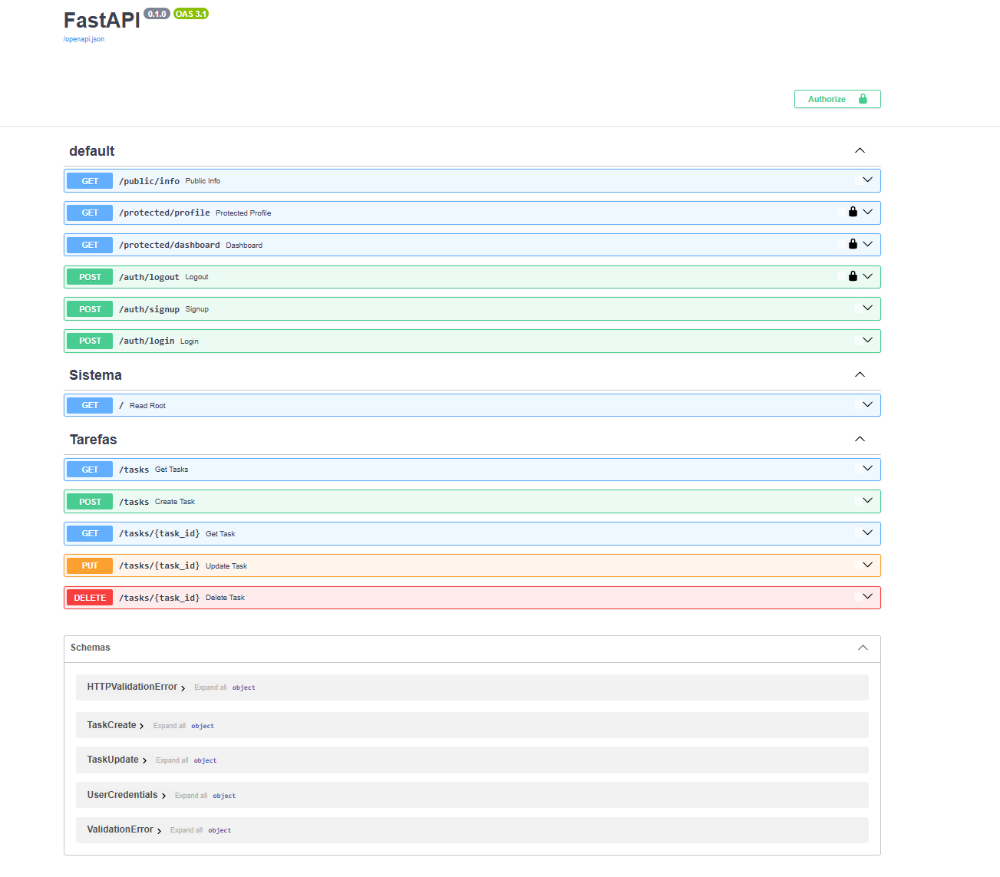
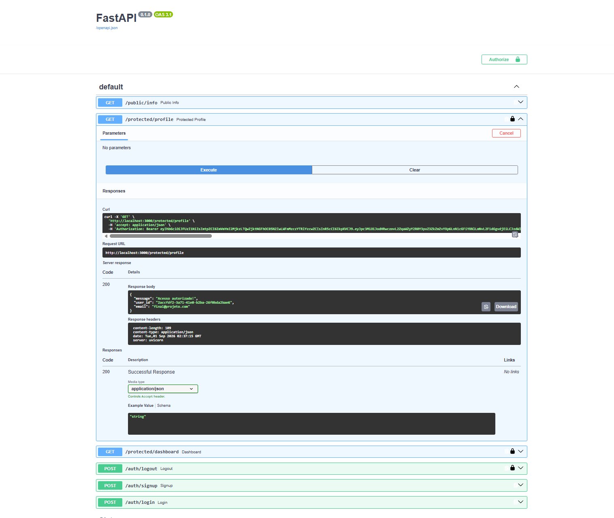

# Task API — FastAPI, PostgreSQL, Docker & Supabase Auth

A RESTful To-Do List API built with Python and FastAPI, evolved through several architectural stages — from in-memory storage to a fully containerized, production-ready service with PostgreSQL persistence and Supabase-based authentication.

## 🛠️ Tech Stack

- **Language & Framework:** Python 3.10+, FastAPI, Pydantic
- **Database:** PostgreSQL, Psycopg
- **Auth & Security:** Supabase Auth (Identity Provider), JWT, HTTPBearer middleware
- **Infrastructure:** Docker, Docker Compose, Git, `.env` secret management

## 🚀 Quick Start

1. Clone the repository and navigate to the project folder.
2. Copy `.env.example` to `.env` and fill in the required database and Supabase variables.
3. Start the full stack with a single command:
   ```bash
   docker compose up --build
   ```
4. The server runs at `http://localhost:3000`. Interactive Swagger docs are available at `http://localhost:3000/docs`.

## 🗂️ Endpoints

### Task Management
| Operation | Method | Endpoint | Description |
| :--- | :--- | :--- | :--- |
| Read (List) | `GET` | `/tasks` | Lists all tasks (supports `limit`/`offset` pagination) |
| Read (Single) | `GET` | `/tasks/{task_id}` | Returns a specific task by ID |
| Create | `POST` | `/tasks` | Creates a new task |
| Update | `PUT` | `/tasks/{task_id}` | Updates a task's title and/or done status |
| Delete | `DELETE` | `/tasks/{task_id}` | Deletes a task |
| Info | `GET` | `/` | General API information |
| Health | `GET` | `/health` | Server health check |

### Authentication (Supabase)
| Endpoint | Method | Auth Required | Description |
| :--- | :--- | :--- | :--- |
| `/auth/signup` | `POST` | No | Creates a new user account |
| `/auth/login` | `POST` | No | Authenticates the user and returns a JWT |
| `/auth/logout` | `POST` | Yes | Ends the local user session |
| `/public/info` | `GET` | No | Public endpoint, no token needed |
| `/protected/profile` | `GET` | Yes | Returns protected profile data (requires JWT) |
| `/protected/dashboard` | `GET` | Yes | Demonstrates reusable auth middleware |

## 📖 Interactive Documentation (Swagger UI)

FastAPI automatically generates a live OpenAPI/Swagger UI at `http://localhost:3000/docs`, where all endpoints — including the protected routes secured by JWT — can be explored and tested directly from the browser.





## 🏗️ Architecture & Design Decisions

- **Persistent storage:** Data lives in PostgreSQL, running in its own Docker container with a persistent volume — restarting the API no longer resets the data.
- **Pagination:** `GET /tasks` supports `limit`/`offset` to avoid loading the entire dataset into memory at once.
- **Validation & error handling:** Empty-string titles return `400 Bad Request`; requests for non-existent task IDs return `404 Not Found` with a clear JSON error.
- **Delegated authentication:** Supabase acts as the Identity Provider, issuing and managing JWTs.
- **Layered protection:** Reusable FastAPI `Depends()` middleware validates JWT signatures before granting access to private routes.
- **Containerization:** Docker Compose orchestrates the API and database together for a reproducible environment.

## 🤖 Project Evolution & AI Audits

Throughout development, AI tools were used for technical code review, comparing human-written logic against AI-generated boilerplate at each migration stage (in-memory → SQLite → PostgreSQL).

**Where AI did well:**
- Used advanced Pydantic features (`Field`, `Optional`) and the `fastapi.status` module instead of hardcoded status codes.
- Applied solid architectural patterns: `contextmanager` for connection handling, `sqlite3.Row` for readable column access, and DRY helper functions (`find_task`, `row_to_task`).
- Proactively wrote full Pydantic schemas with rich Swagger descriptions.

**Where AI fell short or overstepped:**
- Made unstated assumptions about data model structure when prompts were brief.
- Missed unspecified requirements (e.g., pagination wasn't implemented until explicitly requested).
- Used the deprecated `@app.on_event("startup")` decorator instead of FastAPI's current lifespan events.
- Generated its own seed data based on assumptions not given in the prompt.

**Takeaway:** AI is strong for boilerplate and surfacing design patterns, but human review remains essential for catching deprecated practices and keeping full architectural control.