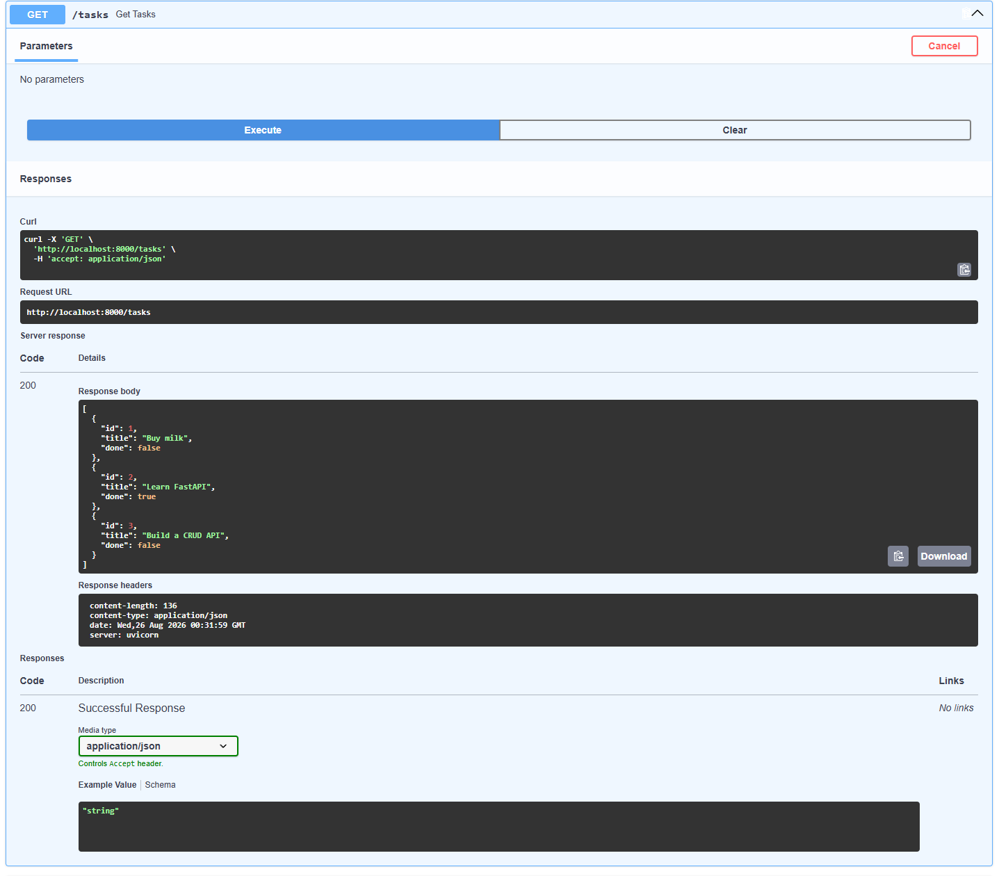
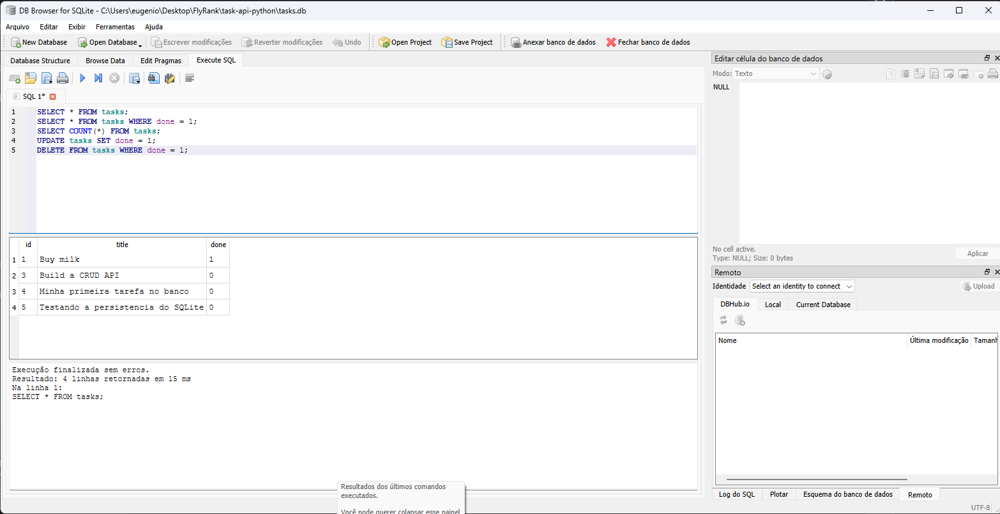

# Task API - FastAPI, PostgreSQL & Docker

A RESTful API built with Python and FastAPI to manage a to-do list. This project was developed to demonstrate the practical application of core backend skills, including CRUD operations, robust HTTP status management, data validation, and modern containerization. By transitioning from in-memory storage to a **PostgreSQL** relational database orchestrated via **Docker Compose**, this API reflects real-world architectural standards.

## 🚀 Quick Start (One-Command Setup)

This API is fully containerized, ensuring it runs identically on any machine without local environment conflicts.

### Prerequisites
- Docker & Docker Compose
- Git

### Installation & Execution
1. Clone the repository and navigate to the project folder.
2. Copy the `.env.example` file and rename it to `.env` (it contains the necessary database variables).
3. Start the entire stack (API + Database) with a single command:
   ```bash
   docker compose up
   ```

The server will start at `http://localhost:3000`.

## 🗂️ Endpoints Reference

The API provides the following endpoints to manage tasks.

| Operation | HTTP Method | Endpoint | Description |
| :--- | :--- | :--- | :--- |
| **Read (List)** | `GET` | `/tasks` | Returns a list of all tasks |
| **Read (Single)** | `GET` | `/tasks/{task_id}` | Returns a specific task by its ID |
| **Create** | `POST` | `/tasks` | Creates a new task (requires JSON body) |
| **Update** | `PUT` | `/tasks/{task_id}` | Updates a task's title and/or done status |
| **Delete** | `DELETE` | `/tasks/{task_id}` | Deletes a task by its ID |
| **Info** | `GET` | `/` | Returns general API information |
| **Health** | `GET` | `/health` | Returns the server's health status |

## 💻 cURL Example

Here is a complete example of a `POST` request creating a new task, demonstrating the JSON input and the exact HTTP response (including the `201 Created` status code).

**Request:**
```bash
curl -i -X POST http://localhost:3000/tasks -H "Content-Type: application/json" -d '{"title":"Buy coffee"}'
```

**Response:**
```http
HTTP/1.1 201 Created
date: Tue, 25 Aug 2026 01:25:46 GMT
server: uvicorn
content-length: 42
content-type: application/json

{"id":4,"title":"Buy coffee","done":false}
```

## 📖 Interactive Documentation (Swagger UI)

FastAPI automatically generates a live, interactive OpenAPI documentation. Once the server is running, you can access the Swagger UI to explore and test all endpoints directly from your browser without needing tools like Postman or cURL.

**Access the docs at:** `http://localhost:3000/docs`



## 🏗️ Technical Details & Business Rules
- **Pagination:** The `GET /tasks` endpoint supports pagination via `limit` and `offset` query parameters. Real-world APIs never return "everything" at once because retrieving millions of records simultaneously would consume excessive server memory, overload the database, and result in massive network delays for the client.
- **Persistent Storage:** Data is stored in a **PostgreSQL** database running in its own Docker container. Restarting the API service no longer resets the data — the database keeps its state in a Docker volume.
- **Validation:** Creating or updating a task with an empty string as a title returns a `400 Bad Request`.
- **Error Handling:** Requesting, updating, or deleting a non-existent task ID returns a `404 Not Found` with a clear JSON error message.
## DB Persistence Snapshot

### 🤖 Project Evolution & AI Audits (Code Review)

Throughout the development of this API, AI tools were used for technical auditing and code reviews to compare human-written logic with AI-generated boilerplates.

### Stage 7: The Rematch (In-Memory phase)

**1. What did the AI do better?**
The AI included a very helpful top-level docstring to explain the module. It also utilized more advanced Pydantic features like `Field` for data validation, the `typing.Optional` module for clearer type hinting, and the `fastapi.status` module instead of hardcoding HTTP status integers.

**2. What did it get wrong or quietly ignore?**
Because the prompt was somewhat brief, the AI assumed its own structure for the data model initialization, which might differ from a strictly simple dictionary list if not tightly constrained.

**3. What did your prompt forget to specify?**
I completely forgot to specify the "Stretch Goal" in the prompt! I didn't ask the AI to implement Pagination (`limit` and `offset`) for the `GET /tasks` route, so it built a standard route that returns all items at once.

### DB Browser Snapshot


## 🐘 Final Stage: PostgreSQL & Docker Persistence Proof

To confirm the migration from SQLite to a fully containerized **PostgreSQL** database was successful, the persistence was verified directly inside the running container via the `psql` CLI — connecting to the `tasks` database and querying the `tasks` table to confirm both the schema (`\dt`) and the seeded data survived a container restart.


```bash
docker exec -it task-api-python-db-1 psql -U postgres -d tasks
```

```
tasks=# \dt
        List of relations
 Schema | Name  | Type  |  Owner
--------+-------+-------+----------
 public | tasks | table | postgres
(1 row)

tasks=# SELECT * FROM tasks;
 id |            title             | done
----+-------------------------------+------
  1 | Aprender Docker               | f
  2 | Configurar variáveis de ambiente | t
  3 | Conectar API no Postgres      | f
(3 rows)
```

This confirms the data is no longer tied to the Python process's memory or a local `.db` file — it now lives in a dedicated, containerized relational database, exactly as it would in a production environment.

## 🤖  Bonus Stage: AI Code Review (SQLite phase)

In this bonus stage, I created a prompt with strict business rules and challenged an AI (Claude) to perform the same storage migration. The goal was to conduct a technical audit (code review) to compare the solutions.

### What the AI did better (Architectural Wins)

* **Connection Management:** Implemented a `contextmanager` to open and close the database connection on each request, preventing memory leaks.
* **Data Access:** Used `conn.row_factory = sqlite3.Row`, which allows accessing values by column name (e.g., `row["title"]`) instead of indices, making the code more readable and maintainable.
* **DRY Principle (Don't Repeat Yourself):** Created helper functions (`find_task`, `row_to_task`) to isolate lookup and formatting logic, reducing code duplication across the routes.

### What the AI got wrong or quietly overlooked (Points of Attention)

* **Deprecated Features:** The AI used the `@app.on_event("startup")` decorator for database initialization. In recent versions of FastAPI, this method has been deprecated, with Lifespan events being the current recommended practice.

### What wasn't requested and it decided on its own (Implicit Behavior)

* **Data Validation:** Proactively implemented full Pydantic schemas (`TaskCreate`, `TaskUpdate`) and rich descriptions for Swagger, even without explicit requirements in the prompt.
* **Specific Mock Data:** Generated highly specific seed data based on its own assumptions (e.g., "Set up CNC router").

**Verdict:** The AI tool is excellent for generating boilerplate and suggesting more advanced design patterns, but critical human review remains indispensable for spotting outdated practices in framework documentation and maintaining full control over the application's architecture.